```{r setup, include=FALSE}
knitr::opts_chunk$set(echo = TRUE)
```

On September 8, 2023, Morocco experienced one of the most devastating earthquakes in recent history. The earthquake struck 70 km southwest of the Marrakesh region with a magnitude of 6.8. The impact of the earthquake was devastating, causing widespread destruction in parts of the Atlas mountains, including the city of Marrakech and surrounding areas. The earthquake resulted in nearly 3,000 deaths and left a lasting impact on the lives of thousands of survivors, particularly in the Al-Haouz province. This earthquake is among the most destructive in Morocco's recent history, underscoring the geological risks the country faces due to its location. The Mediterranean region, including Morocco, is a zone of convergence between the African and European continents, leading to significant seismic activity. This activity results from the slow but constant narrowing of the Mediterranean, which was once a much larger ocean, leading to the formation of mountain ranges and the creation of fault lines. Such geological settings make regions like Morocco vulnerable to devastating earthquakes.

Below are plots from a [recent coverage](https://www.nytimes.com/interactive/2023/09/09/world/africa/morocco-earthquake-damage.html) about earthquakes in Morocco by the New York Times.

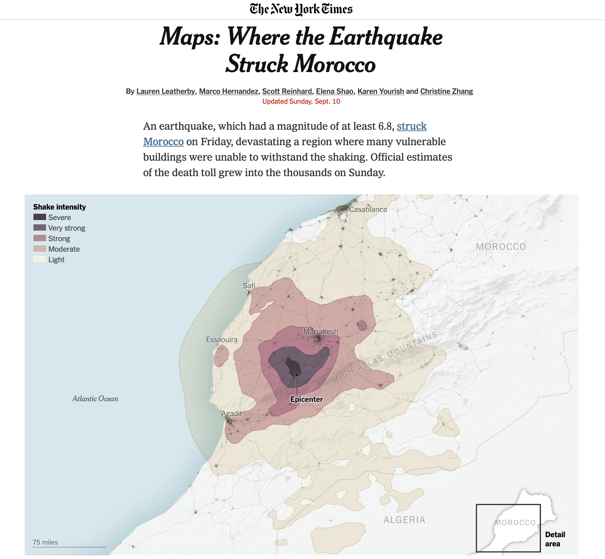


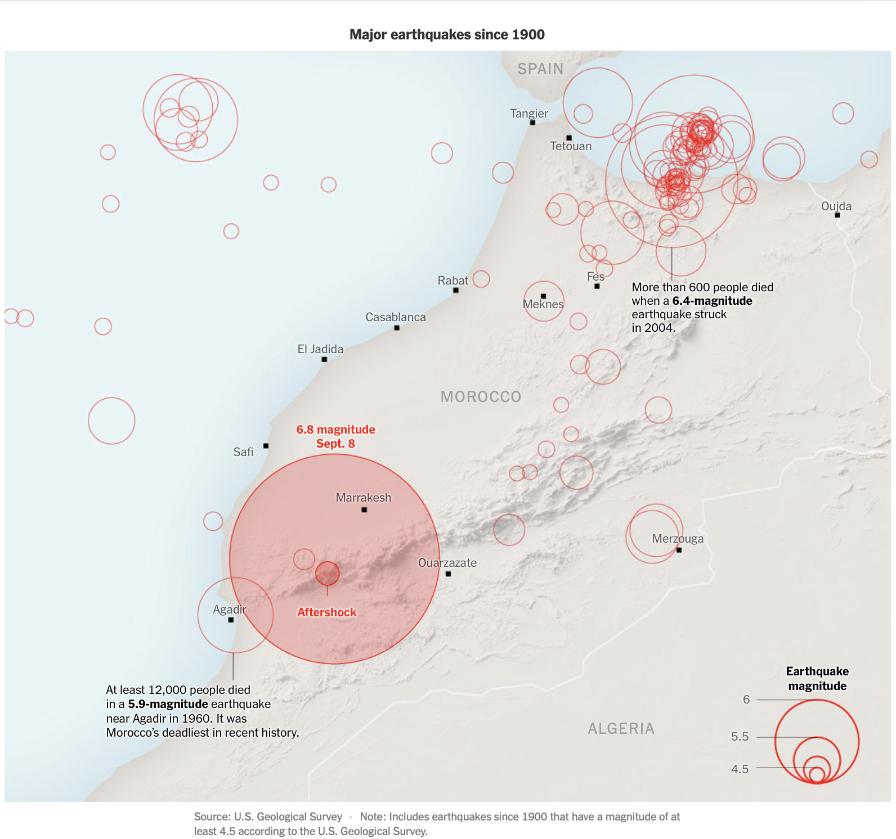

Motivated by this phenomena, I decided to undertake earthquakes in Morocco as a subject of study for my final project. In the following report, I illustrate the steps I took to collect data, clean it and analyze it using techniques studied in class. Specifically, I fit a Kernel Smoothing, and Marked-Unmarked L, G, J, F, K, and weighted K functions to analyze clustering behavior of seismic activity in the spatial region. Then, I fit a Pseudo Log-Likelihood model, a Poisson Stoyan model, and Hawkes model to investigate whether these models can capture the seismic activity for informing predictions about future earthquakes. 

## Dataset
I obtained a list of all earthquakes occurring in Morocco from the [Centre Sismologique Euro-Méditerranéen Euro-Mediterranean Seismological Centre](https://www.emsc-csem.org/Earthquake_information/). The dataset contained the following variables: date, time, latitude, longitude, region name, depth, magnitude, magnitude type. The earthquake activity ranged from events occuring in the year 2004 to 2023. This did not include the 1960 earthquake that killed over 15, 000 people. 

```
library(dplyr)
library(readr)

# Function to read each file with a semicolon delimiter
read_delim_semicolon <- function(file) {
  read_delim(file, delim = ";", col_names=TRUE)
}

# Read and combine files
earthquakes <- list.files(path="data", full.names=TRUE) %>% 
  lapply(read_delim_semicolon) %>% 
  bind_rows()
```
Let us visualize the earthquakes as spatial points overlayed on a map of Morocco.
```
# plot earthquake points on map of Morocco
library(maps)
library(ggplot2)
map_data_morocco <- map_data('world')[map_data('world')$region == "Morocco",]

## The map (maps + ggplot2 )
ggplot()+
  ## First layer: worldwide map
  geom_polygon(data = map_data('world'),
               aes(x=long, y=lat, group = group),
               color = '#9c9c9c', fill = '#f3f3f3') +
  ## Second layer: Country map
  geom_polygon(data = map_data_morocco,
               aes(x=long, y=lat, group = group),
               color = 'green', fill='lightgreen') +
  coord_map() +
  ## Third layer: Earthquake points
  geom_point(data = earthquakes, aes(x=Longitude, y=Latitude, color=Magnitude), size=0.1) +
  scale_colour_gradient(low = "yellow", high = "red") +
  coord_fixed(1.3,
              xlim = c(-20, 0),
              ylim = c(20, 37)) +
  ggtitle("Earthquakes in Morocco from 2004 to 2023") +
  theme(panel.background =element_rect(fill='lightblue'))
```
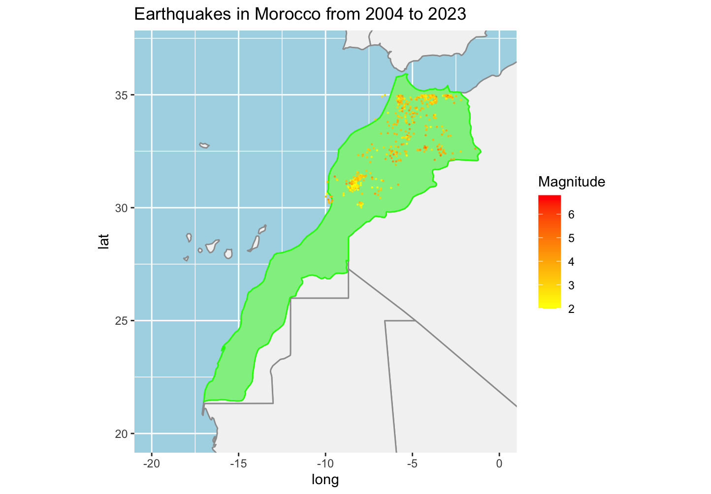
We can also normalize the latitude and longitude values for better interpretibility.
```
scale_values <- function(x){(x-min(x))/(max(x)-min(x))}

# plot earthquake points on a normalized scale
x1 <- scale_values(earthquakes$Longitude)
y1 <- scale_values(earthquakes$Latitude)
par(mfrow=c(1,1))
plot(c(0,1),c(0,1),type="n",xlab="long",ylab="lat",
     main="Earthquakes in Morocco from 2004 to 2023")
points(x1,y1,pch=3, cex=0.5)

```
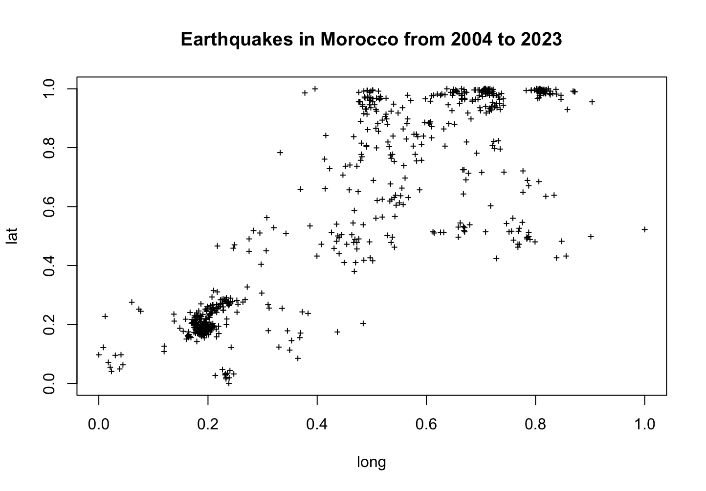

We can also run kernel smoothing to visualize the rate of points. Overall, we see that the rates in these concentrated North and South regions are very high (dark grey) while other regions are low (light gray to white). 
```
n = length(x1)
###  Kernel smoothing 
stddist = sqrt(1/n*(sum((x1-mean(x1))^2)+sum((y1-mean(y1))^2))) ## standard distance 
ds = sqrt((x1-mean(x1))^2+(y1-mean(y1))^2) ## distances to mean 
dm = median(ds) 
bdw = .9*min(stddist,sqrt(1/log(2))*dm)*n^-.2 
## this is the suggestion in 
## https://desktop.arcgis.com/en/arcmap/10.3/tools/spatial-analyst-toolbox/how-kernel-density-works.htm
#bdw = sqrt(bw.nrd(x1)^2+bw.nrd(y1)^2)  ## another option for a default bandwidth
# bdw = .2 ## or just pick a reasonable bandwidth yourself, like this.
b1 = as.points(x1,y1)
bdry = matrix(c(0,0,1,0,1,1,0,1,0,0),ncol=2,byrow=T)
z = kernel2d(b1,bdry,bdw)
par(mfrow=c(1,2))
image(z,col=gray((64:20)/64),xlab="x",ylab="y")
points(b1, pch=3, cex=0.5)
x4 = (0:100)/100*(max(z$z)-min(z$z))+min(z$z)
plot(c(0,10),c(.8*min(x4),1.2*max(x4)),type="n",axes=F,xlab="",ylab="")
image(c(-1:1),x4,matrix(rep(x4,2),ncol=101,byrow=T),add=T,col=gray((64:20)/64))
text(2,min(x4),as.character(signif(min(x4),2)),cex=1)
text(2,(max(x4)+min(x4))/2,as.character(signif((max(x4)+min(x4))/2,2)),cex=1)
text(2,max(x4),as.character(signif(max(x4),2)),cex=1)
mtext(s=3,l=-3,at=1,"Rate (pts per unit area)")
mtext("Kernel Smoothing", side = 3, line = -3, outer = TRUE)
## repeat the above, trying other values of bdw, for more or less 
## smoothing.
```
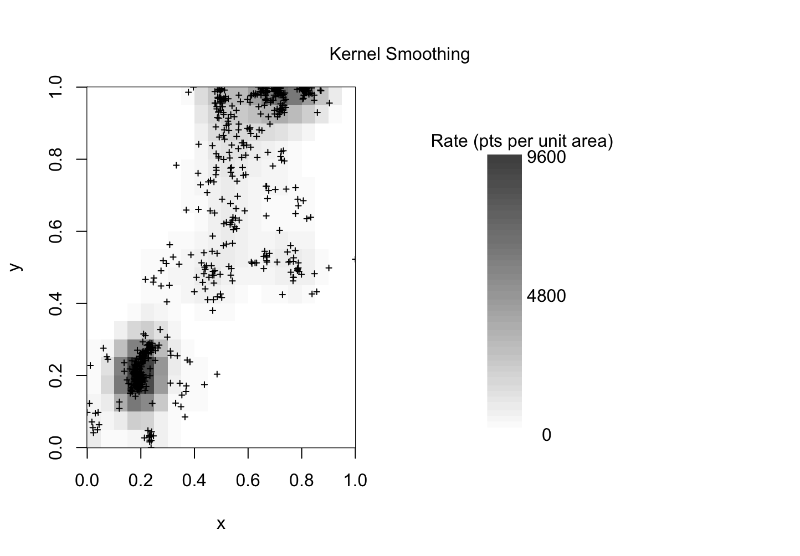
The spatial points can be treated as marked points by considering the magnitude of the earthquake at a particular latitude and longitude.

```
#### Marked Points
x1 = scale_values(earthquakes$Longitude)
y1 = scale_values(earthquakes$Latitude)
n1 = length(x1)
z1 = earthquakes$Magnitude
z2 = (z1 - min(z1))/(max(z1)-min(z1)) ## rescaled to [0,1].

par(mfrow=c(1,1))
plot(c(0,1),c(0,1),type="n",xlab="long",ylab="lat",
     main="Earthquakes in Morocoo from 2004 to 2023 by Magnitude")
points(x1,y1,pch=1,cex=2*z2)
```
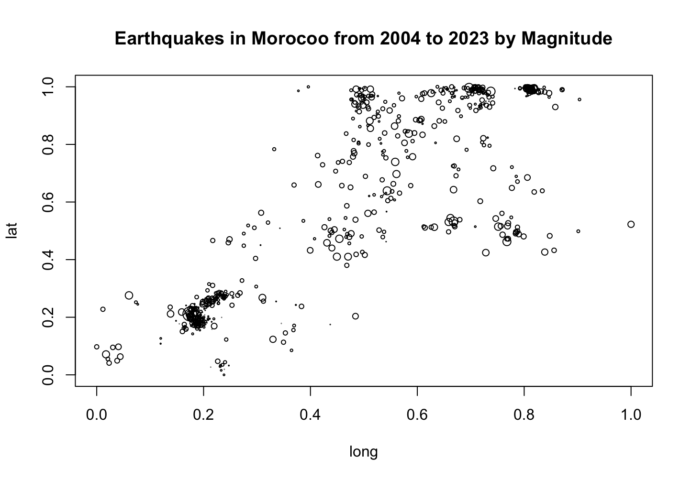

A kernel smoothing estimate of the marked spatial points shows that the highest magnitude earthquakes occurred in the southern region of Morocco. 
```
### Kernel smoothing, using bandwidth h
par(mfrow=c(1,2))
h = .05 
## h should usually be a fraction (roughly 1/4 or so) 
## of the range of your x-coordinates or y-coordinates
## you can use bw.nrd0(x1) or bw.nrd0(y1) as a guide
n2 = 20
mygrid1 = seq(0,1,length=n2)
mygrid2 = seq(0,1,length=n2)
a1 = matrix(0,ncol=n2,nrow=n2)
for(i in 1:n2){
  for(j in 1:n2){
    a1[i,j] = sum(z1 * dnorm(
      sqrt((mygrid1[i]-x1)^2 + (mygrid2[j]-y1)^2),sd=h)) 
    # / sum(dnorm(sqrt((mygrid1[i]-x1)^2 + (mygrid2[j]-y1)^2),sd=h))
  }
}

image(mygrid1,mygrid2,a1,xlab="long",ylab="lat",zlim=range(a1),
      col=grey(c(64:20)/64))
points(x1,y1,pch=1,cex=z2,col="green")
## You might want to ignore the line above if there are too many points.

## legend
x = a1
zmin = min(x)
zmax = max(x)
zrng = zmax - zmin
zmid = zmin + zrng/2
plot(c(0,10),c(zmid-2*zrng/3,zmid+2*zrng/3),type="n",axes=F,xlab="",ylab="")
zgrid = seq(zmin,zmax,length=100)
## zgrid = vector of 100 equally-spaced numbers spanning range of the values.
image(c(-1:1),zgrid,matrix(rep(zgrid,2),ncol=100,byrow=T),add=T,
      zlim=range(x),col=grey((64:20)/64))
text(2.5,zmin,as.character(signif(zmin,2)),cex=1)
text(2.5,zmax,as.character(signif(zmax,2)),cex=1)
text(2.5,zmid,as.character(signif(zmid,2)),cex=1)
text(4.5,zmid,"rate (pts/unit area)",srt=-90)
mtext("Kernel Smoothing", side = 3, line = -3, outer = TRUE)
```
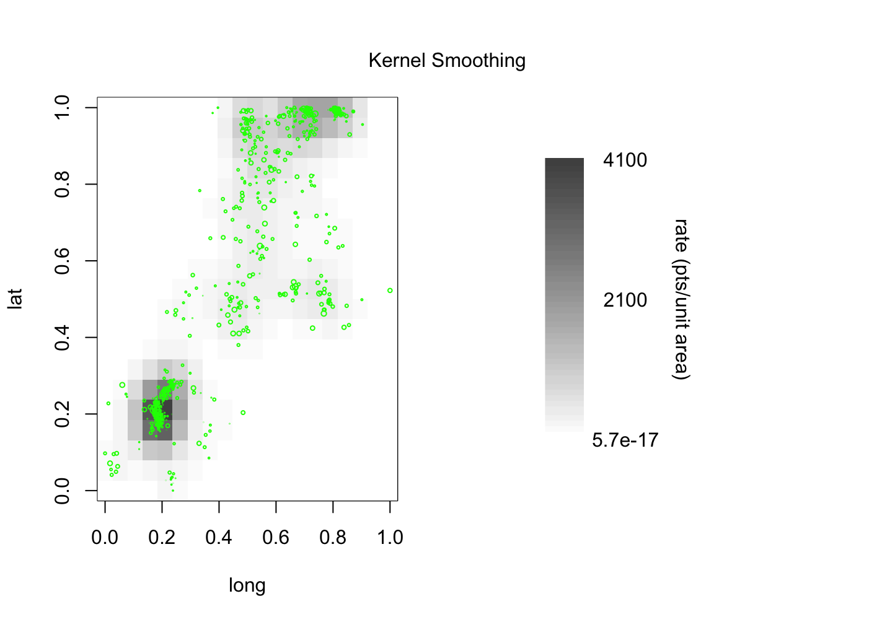

The quadrant counts are also high (dark gray) in this region. 
```
##### Quadrat totals

x = matrix(0,ncol=10,nrow=10)
for(i in 1:10){
  for(j in 1:10){
    for(k in 1:n1){
      if((x1[k]<i/10) && (x1[k] >= (i-1)/10) &&
         (y1[k]<j/10) && (y1[k] >= (j-1)/10)) x[i,j] = x[i,j] + z1[k]
    }
  }}
## can check that sum(x) should = sum(z1)

##### Plot the quadrat counts
par(mfrow=c(1,2))  ## makes a 1x2 grid of plots on the graphic screen
plot(c(0,1),c(0,1),type="n",xlab="long",ylab="lat",
     main="Quadrat counts of Earthquakes in Morocco")
image(x=c(0:9)/10+.05,y=c(0:9)/10+.05,z=x,col=grey(c(64:20)/64),add=T)
#points(x1,y1,pch=1,cex=1+3*z2)
## Again, you might not want to do the points() command above, if there 
## are too many points.
######### LEGEND:
zmin = min(x)
zmax = max(x)
zrng = zmax - zmin
zmid = zmin + zrng/2
plot(c(0,10),c(zmid-2*zrng/3,zmid+2*zrng/3),type="n",axes=F,xlab="",ylab="")
zgrid = seq(zmin,zmax,length=100)
## zgrid = vector of 100 equally-spaced numbers spanning range of the values.
image(c(-1:1),zgrid,matrix(rep(zgrid,2),ncol=100,byrow=T),add=T,col=gray((64:20)/64))
text(2.5,zmin,as.character(signif(zmin,2)),cex=1)
text(2.5,zmax,as.character(signif(zmax,2)),cex=1)
text(2.5,zmid,as.character(signif(zmid,2)),cex=1)
text(4.5,zmid,"total sum of marks",srt=-90)
```
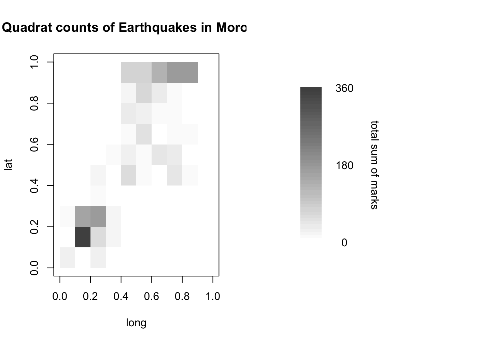

All of the plots above suggest clustering in the northern and southern regions of Morocco. Let us further analysis this clustering behavior.

## Analysis of Clustering
We can fit F, G, K, and L functions to analyze clustering of points in the spatial region of Morocco. High clustering of points in a particular region would indicate high susceptibility to seismic activity in that region.

First we fit the K and L functions.
```
######### K-function & L-function:

## par(mfrow=c(2,1)) ## if you want to make a 2x1 grid of plots
s = seq(.001,.3,length=50)
k4 = khat(b1,bdry,s)
plot(s,k4,xlab="distance",ylab="K4(h)",pch="*")
lines(s,k4)
lines(s,pi*s^2,lty=2)
L4 = sqrt(k4/pi)-s
plot(c(0,.3),range(L4),type="n",xlab="lag, h",ylab="L4(h) - h")
points(s,L4,pch="*")
lines(s,L4)
lines(s,rep(0,50),lty=2)

### CONFIDENCE BOUNDS FOR K-FUNCTION via simulation 
k4conf = Kenv.csr(npts(b1), bdry, 1000, s) 
plot(c(0,max(s)),c(0,max(k4conf$upper,k4)), type="n",xlab="distance",ylab="K4(h)")
points(s,k4,pch="*") 
lines(s,k4) 
lines(s,pi*s^2,lty=2)
lines(s,k4conf$upper,lty=3,col="green",lwd=2) 
lines(s,k4conf$lower,lty=3,col="green",lwd=2) 
L4upper = sqrt(k4conf$upper/pi) - s  
L4lower = sqrt(k4conf$lower/pi) - s 

plot(c(0,max(s)),c(min(L4lower,L4),max(L4upper,L4)), 
     type="n",xlab="distance",ylab="L4(h) - h") 
points(s,L4,pch="*") 
lines(s,L4) 
lines(s,L4upper,lty=2,col="green",lwd=2) 
lines(s,L4lower,lty=2,col="green",lwd=2) 
lines(s,rep(0,length(s))) 

### THEORETICAL BOUNDS for L-function 
## bounds = 1.96 * sqrt(2*pi*A) * h / E(N), where 
## A = area of space, and 
## E(N) = expected # of pts in the space (approximated here using 
## the observed # of pts 
L4upper = 1.96 * sqrt(2*pi*1*1) * s / n 
L4lower = -1.0 * L4upper 
lines(s,L4upper,lty=3,col="orange",lwd=2) 
lines(s,L4lower,lty=3,col="orange",lwd=2) 
mtext("K and L functions", side = 3, line = -3, outer = TRUE)
```
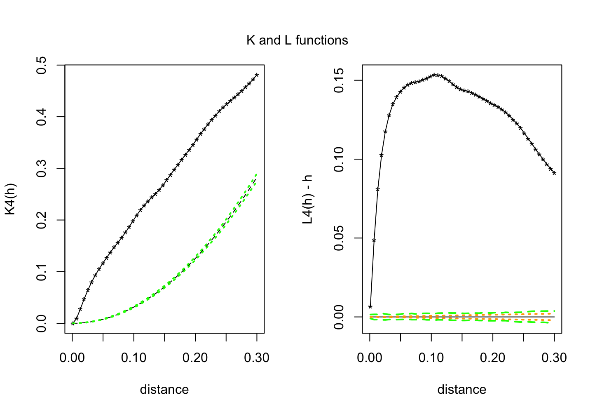
The K value of the function is greater than a poisson process, suggesting high clustering. The L value of the function is higher than L(r) = 0 throughout which also confirms high clustering. 

```
#### F-function (empty-space function): 
## The cumulative distribution function (cdf), F, 
## of the distance from a fixed location to the nearest point of X. 
## Lower F indicates clustering. 
## If F(0.2) = 0.4, for instance, then 
## 40% of locations are within distance 0.2 of a point of the process. 
b2 = as.ppp(b1, W = c(0,1,0,1)) 
## the above convert the points into a "ppp" object, 
## using as a window [0,1] x [0,1] 
par(mfrow=c(1,1)) 
f4 = Fest(b2) 
plot(f4, main="") 
## or to control the plot yourself, try: 
plot(f4$r[f4$r<.5],f4$theo[f4$r<.5],xlab="h",ylab="F(h)",type="l",lty=2) 
lines(f4$r[f4$r<.5],f4$rs[f4$r<.5],lty=1) 
legend(.2,.2,lty=c(1,2),legend=c("data","Poisson")) 
```
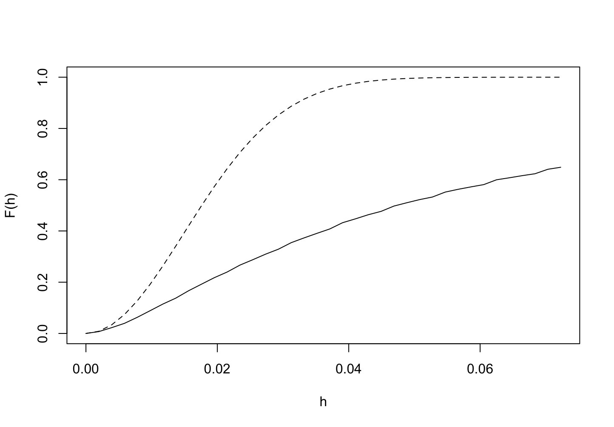

The F function is lower than a poisson distribution suggesting that there is clustering. 

```
#### G-function: 
## the cdf, G, of the distance from a typical point to its nearest neighbor. 
## Higher G indicates clustering. 
## If G(0.2) = 0.9, then 90% of points have another point within 0.2 of them. 
g4 = Gest(b2) 
plot(g4, main="") 
## or to control the plot yourself, try: 
plot(g4$r[g4$r<.3],g4$rs[g4$r<.3],xlab="h",ylab="G(h)",type="l",lty=1) 
lines(g4$r[g4$r<.3],g4$theo[g4$r<.3],lty=2) 
legend(.2,.2,lty=c(1,2),legend=c("data","Poisson")) 
```
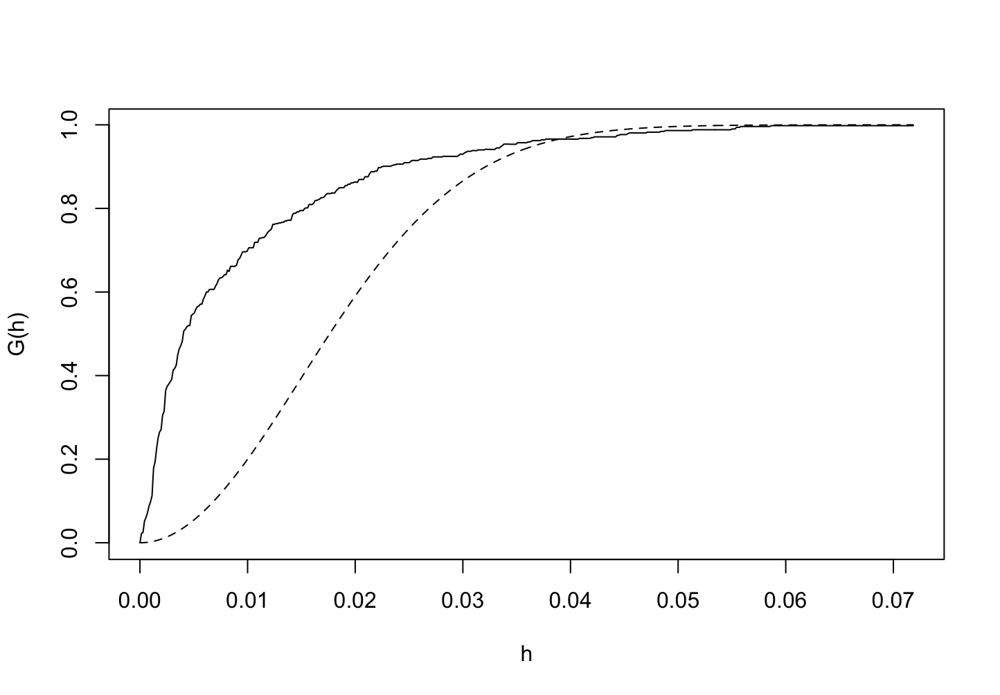

The G function is above the possion distribution suggesting that there is regular spacing among earthquakes. 

```
#### J-function: 
## J(r) = (1-G(r))/(1-F(r)). 
## J = 1 corresponds to a stationary Poisson process. 
## J < 1 indicates clustering. J > 1 indicates inhibition. 
j4 = Jest(b2) 
plot(j4, main="") 
## or to control the plot yourself, try: 
plot(j4$r[j4$r<.1],j4$rs[j4$r<.1],xlab="h",ylab="J(h)",type="l",lty=1) 
lines(j4$r[j4$r<.1],j4$theo[j4$r<.1],lty=2) 
legend("topleft",lty=c(1,2),legend=c("data","Poisson"))
```
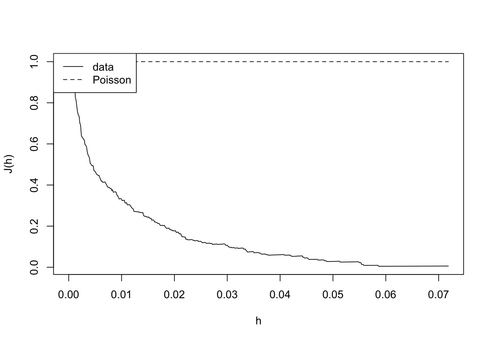

The value of the J function is less than 1 throughout suggesting that the epicenters of earthquakes are evenly spaced out compared to a poisson distribution.  This is possibly because earthquakes of low magnitude are consistently occurring in Morocco. 

The spatial points can be treated as marked points by considering the magnitude of the earthquake at a particular latitude and longitude. 

```
### Marked J-function:
b2 = as.ppp(cbind(x1,y1), W = c(0,1,0,1))   
b2$marks = z1
b2$n = n1 
## the above convert the points into a "marked ppp" object, 
## using as a window [0,1] x [0,1]
par(mfrow=c(1,1))
jm4 = Jmulti(b2, b2$marks < 5 & b2$marks>1, b2$marks > 6)
plot(jm4, main="")
## or to control the plot yourself, try:
plot(jm4$r[jm4$r<.5],jm4$rs[jm4$r<.5],xlab="h",ylab="J(h)",type="l",lty=1, main='Marked J Function') 
lines(jm4$r[jm4$r<.5],jm4$theo[jm4$r<.5],lty=2) 
legend(.2,.2,lty=c(1,2),legend=c("data","Poisson"))
```
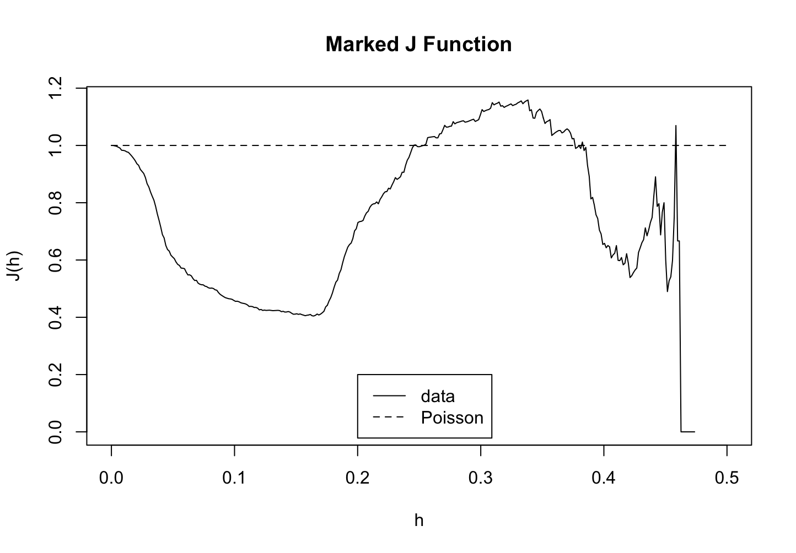

The value of the marked J function suggests clustering for distances between 0.2 to 0.4. 

```
## try playing around with this, for different classes of marks instead 
## of < 4.5, and > 5.5
######### Marked K-function & L-function:
par(mfrow=c(1,2))
km4 = Kmulti(b2, b2$marks < 6, b2$marks > 3)
plot(km4$r[km4$r<.3],km4$border[km4$r<.3],xlab="h",ylab="K(h)",type="l",lty=1) 
lines(km4$r[km4$r<.3],km4$theo[km4$r<.3],lty=2) 
legend("bottomright",lty=c(1,2),legend=c("data","Poisson"))
Lm4 = sqrt(km4$border[km4$r<.3]/pi)-km4$r[km4$r<.3]
plot(c(0,.3),range(Lm4),type="n",xlab="lag, h",ylab="L4(h) - h")
points(km4$r[km4$r<.3],Lm4,pch="*", cex=.5)
lines(km4$r[km4$r<.3],Lm4)
abline(h=0,lty=2)

### THEORETICAL BOUNDS for L-function
## bounds = 1.96 * sqrt(2*pi*A) * h / E(N), where 
## A = area of space, and 
## E(N) = expected # of pts of type j in the space  (approximated here using
## the observed # of pts of type j
s = km4$r[km4$r<.3]
L4upper = 1.96 * sqrt(2*pi*1*1) * s / sum(b2$marks > 5.5)
L4lower = -1.0 * L4upper
lines(s,L4upper,lty=3)
lines(s,L4lower,lty=3)
mtext("Marked K and L functions for Magnitude between 3 and 6", side = 3, line = -3, outer = TRUE)
```
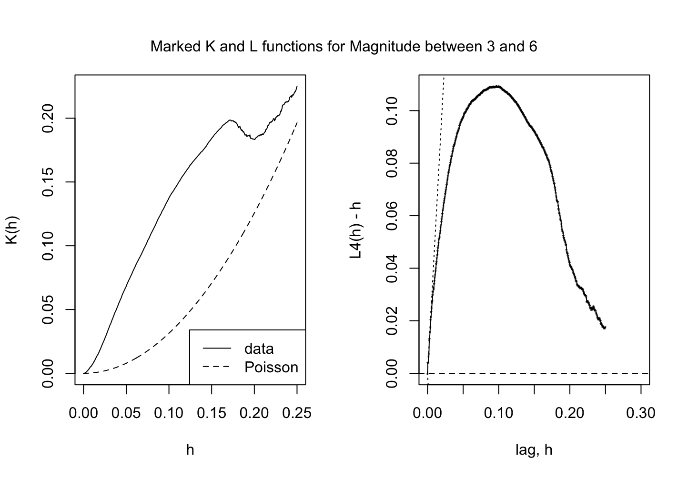

For very small distances below 0.05, the clustering is random, but as the distances increase, both the marked K and J function values suggest more clustering.

```
########### WEIGHTED K-FUNCTION
b1 = as.points(x1,y1)
b2 = as.ppp(b1, W = c(0,1,0,1)) 
# Fit spatial trend: polynomial in x and y coordinates
fit <- ppm(b2, ~ polynom(x,y,3), Poisson())
plot(fit)
# predict intensity values at points themselves
lambda2 <- predict(fit, locations=b2, type="trend")
# inhomogeneous K function
j = 50
r1 = seq(0,.3,length=j)
Ki <- Kinhom(b2, lambda2,r = r1,correction="border")
plot(r1,Ki$bord,type="l",xlab="r",ylab="Kinhom(r)")

f1 = predict(fit)
## Simulation envelopes
m = 200
mysims = matrix(0,nrow=m,ncol=j)
for(i in 1:m){
  a = rpoispp(f1)
  b = predict(fit, locations=a, type="trend")
  Kj = Kinhom(a, b,r=r1,correction="border")
  mysims[i,] = Kj$bord
  cat(i," ")
}

par(mfrow=c(1,1))
plot(Ki, main="Weighted K with Simulations", lwd=2)
for(i in 1:m) lines(r1,mysims[i,],col=grey(.5), lwd=.5)

upk = rep(0,j)
downk = rep(0,j)
for(i in 1:j){
  upk[i] = quantile(mysims[,i],.975)
  downk[i] = quantile(mysims[,i],.025)
}
plot(r1,Ki$bord,type="l")
lines(r1,upk,lty=2,col="orange")
lines(r1,downk,lty=2,col="orange")
mtext("Weighted K Function", side = 3, line = -3, outer = TRUE)
```
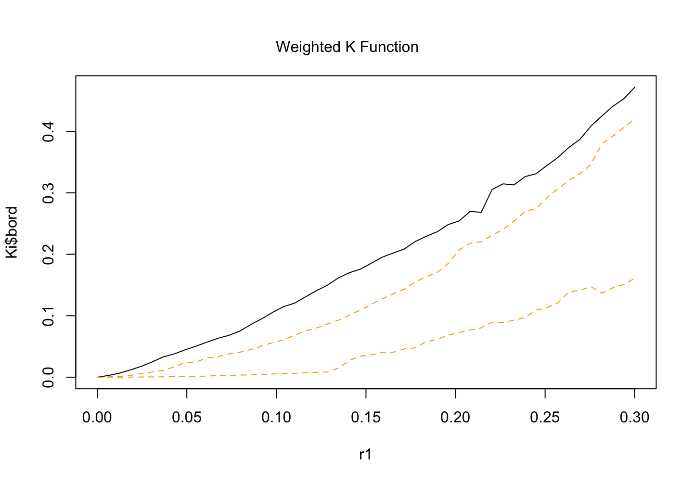
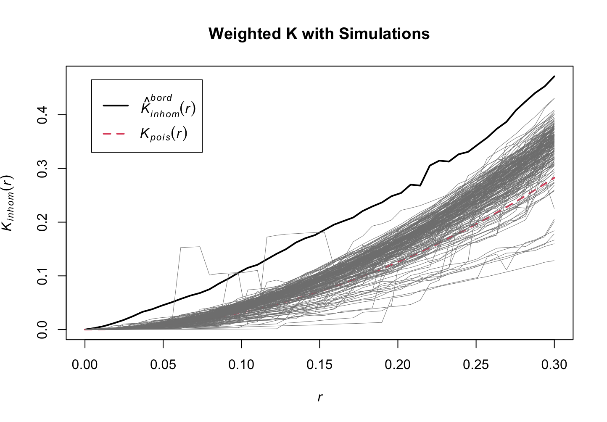

The weighted K function value and simulated K also denotes clustering. 

## Baseline 1 - Fitting a Psuedo Likelihood Model
We can fit a pseudo log likelihood model of the following form.
$\lambda_p(z|z_1, ..., z_k) = \mu + \alpha x+ \beta y + \gamma  \Sigma^{K}_{i=1}\alpha_1e^{-\alpha_1 D(z_i, z)}\frac{1}{2\pi D(z_i, z)}$
where $z=(x,y)$ and $D$ denotes distance. 

```
### Fitting a Pseudo-Likelihood model  
## I'm using the model lambda_p ( s | s_1, ..., s_k) = 
## mu + alpha x + beta y + gamma SUM_{i = 1 to k} a1 z_i exp{-a1 * z_i * D(s_i,s)} 
## where s = (x,y), and where D means distance.
## a1 > 0, so, if gamma is positive, then there is clustering; otherwise inhibition
d1 = as.matrix(dist(cbind(x1,y1))) ## matrix of distances between pts

f = function(p){  
  ## returns the negative pseudo log-likelihood
  ## p = (mu,alpha,beta,gamma,a1)
  if(p[1] < 0) return(99999)
  if(p[1] + p[2] < 0) return(99999)
  if(p[1] + p[3] < 0) return(99999)
  if(p[1] + p[2] + p[3] < 0) return(99999)
  if(p[4] < 0) return(99999)
  if(p[4] > 1) return(99999)
  if(p[5] < 0) return(99999)
  lam = p[1] + p[2] * x1 + p[3] * y1
  for(i in 1:n1){
    for(j in c(1:n1)[-i]){
      lam[i] = lam[i] + p[4] * p[5] * z1[i] * exp(-p[5] * z1[i] * d1[i,j])
    }
  }
  if (min(lam) < 0) return (99999)
  int2 = p[1] + p[2]/2 + p[3]/2 + p[4]*n1
  ## Note that this above is for a window of [0,1] x [0,1]
  cat("integral = ",int2," negative loglikelihood = ",
      int2-sum(log(lam)), "\n"," p = ",p,"\n") 
  ## integral should be roughly n when it's done
  return(int2-sum(log(lam)))
}

pstart = c(1, 2, .1, .2, 10)
fit1 = optim(pstart,f,control=list(maxit=200))
pend = fit1$par

### TO CHECK, COMPARE THE FOLLOWING:
f(pstart)  
f(pend)    
### the latter one should be less.
pend 
## You can run maximum likelihood again, now starting where you left off.
fit2 = optim(pend, f, control=list(maxit=200), hessian=T)
pend = fit2$par ## interpret these parameter estimates!!!
b3 = sqrt(diag(solve(fit2$hess))) ## interpret these standard errors.
pend
b3
```
The table below shows the estimated parameter values. The standard errors for $\gamma$ and $z$ are comparatively low. $\gamma>0$ suggests clustering. In future work, I aim to improve these poor standard errors.

| Parameters | $\mu$  | $\alpha$ | $\beta$| $\gamma$ | $z$    |
| --------------- | ------ | -------- | ------ | -------- | ------ |
| log-likelihood  | 46.16251    | 6.730894      | 437.5413      | 0.6525702   |  7.660825   |
| SE | 63.19339710 |  125.29710945 |  105.01305713 |  0.07714669 |  1.99482107 |

A plot of the model’s background rate does not resemble the spatial points in the region very well. However, the plot of the estimated  values denote a close resemblance to the spatial points in the region. 

```
### Plot the Model's Background Rate
par(mfrow=c(1,2)) ## change this 3 to 2, for your projects.
plot(c(0,1),c(0,1),type="n",xlab="long",ylab="lat",
     main="background rate")
x2 = seq(0.05,0.95,length=10)
y2 = seq(0.05,0.95,length=10)
zz2 = matrix(rep(0,(10*10)),ncol=10)
z3 = matrix(rep(0,(10*10)),ncol=10)
for(i in 1:10){
  for(j in 1:10){
    zz2[i,j] = pend[1] + pend[2]*x2[i] + pend[3]*y2[j]
    z3[i,j] = pstart[1] + pstart[2]*x2[i] + pstart[3]*y2[j]
  }}
zmin = min(c(zz2,z3))
zmax = max(c(zz2,z3))
image(x2,y2,zz2,col=gray((64:20)/64),zlim=c(zmin,zmax),add=T)
points(x1,y1,pch=1,cex=2*z2, col="green")
######### LEGEND:
zrng = zmax - zmin
zmid = zmin + zrng/2
plot(c(0,10),c(zmid-2*zrng/3,zmid+2*zrng/3),type="n",axes=F,xlab="",ylab="")
zgrid = seq(zmin,zmax,length=100)
## zgrid = vector of 100 equally-spaced numbers spanning range of the values.
image(c(-1:1),zgrid,matrix(rep(zgrid,2),ncol=100,byrow=T),add=T,col=gray((64:20)/64))
text(2.5,zmin,as.character(signif(zmin,2)),cex=1)
text(2.5,zmax,as.character(signif(zmax,2)),cex=1)
text(2.5,zmid,as.character(signif(zmid,2)),cex=1)
text(4.5,zmid,"Values",srt=-90)

### PLOT LAMBDA_p over a 10 x 10 grid
par(mfrow=c(1,2)) ## change this 3 to a 2 for your projects.
plot(c(0,1),c(0,1),type="n",xlab="long",ylab="lat",
     main="lambda_p")
x2 = seq(0.05,0.95,length=10)
y2 = seq(0.05,0.95,length=10)
zz2 = matrix(rep(0,(10*10)),ncol=10)
zz3 = matrix(rep(0,(10*10)),ncol=10) 
for(i in 1:10){
  for(j in 1:10){
    zz2[i,j] = pend[1] + pend[2] * x2[i] + pend[3] * y2[j]
    zz3[i,j] = pstart[1] + pstart[2] * x2[i] + pstart[3] * y2[j]
    for(k in c(1:n1)){
      zz2[i,j] = zz2[i,j] + pend[4] * pend[5]*z1[k]*exp(-pend[5] * z1[k] *
                                                          sqrt((x2[i]-x1[k])^2+(y2[j]-y1[k])^2))
      zz3[i,j] = zz3[i,j] + pstart[4] * pstart[5]*z1[k]*
        exp(-pstart[5] * z1[k] * sqrt((x2[i]-x1[k])^2+(y2[j]-y1[k])^2))
    }
  }
}
zmin = min(c(zz2,zz3))
zmax = max(c(zz2,zz3))
image(x2,y2,zz2,col=gray((64:20)/64),zlim=c(zmin,zmax),add=T)
points(x1,y1,pch=1,cex=2*z2, col="green")
######### LEGEND:
zrng = zmax - zmin
zmid = zmin + zrng/2
plot(c(0,10),c(zmid-2*zrng/3,zmid+2*zrng/3),type="n",axes=F,xlab="",ylab="")
zgrid = seq(zmin,zmax,length=100)
## zgrid = vector of 100 equally-spaced numbers spanning range of the values.
image(c(-1:1),zgrid,matrix(rep(zgrid,2),ncol=100,byrow=T),add=T,col=gray((64:20)/64))
text(2.5,zmin,as.character(signif(zmin,2)),cex=1)
text(2.5,zmax,as.character(signif(zmax,2)),cex=1)
text(2.5,zmid,as.character(signif(zmid,2)),cex=1)
text(4.5,zmid,"Intensity estimate (pts/km2)",srt=-90)
```
~[](plots/background_rate_original_guess.png)
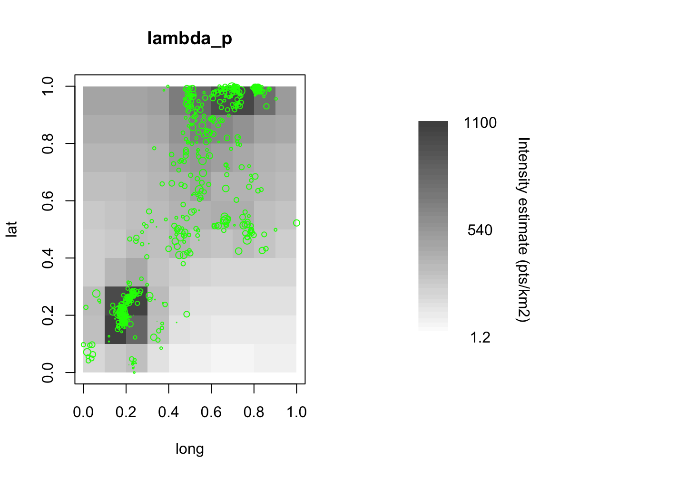

## Baseline 2 – Fitting a Poisson Stoyan Model
We can make a baseline assumption that earthquakes follow a poisson process with independent events evenly distributed over space and time. In a Poisson model, the number of earthquakes expected in a given area and time period follows a Poisson distribution. The key parameter is the rate ($λ$), representing the average number of events (earthquakes) expected in a unit time and/or space. We fit the following poisson model on a unit square (scaled spatial points) to estimate $\beta_1, \beta_2, \beta_3$ by minimizing the sum of square differences between bin areas and the sum of $\frac{1}{\lambda_i}$. This is the Stoyan method where the spatial region is divided into bins. We set $T = 229$ months.
$\lambda(t, x, y) = \beta_1 + \beta_2 x + \beta_3 y$

First we generate a homogeneous poisson process with rate $\alpha$ which is the sum of absolute values of the parameters. Then we thin it by keeping each point with probability $\frac{\lambda}{\alpha}$. 

```
library(splancs)
theta0 = list(b1=4,b2=10,b3=2) 
T = 229 #6939 #229 #months #6939 #num days #max(earthquakes$Date) - min(earthquakes$Date)
m3 = function(x) signif(x,3)
## the max of lambda over B is always ≤ a = |b1|+|b2|+|b3|
## First generate a homogeneous Poisson process of rate a. 
z = list()
b1=theta0$b1;b2=theta0$b2;b3=theta0$b3
a = abs(b1) + abs(b2) + abs(b3) 
candn = rpois(1,a*T)
candx = runif(candn)
candy = runif(candn)
candt = runif(candn)*T
## Then thin it keeping each pt with prob lambda/a.
d = runif(candn)
lam = b1 + b2*candx + b3*candy 
keep = (d<lam/a)
z$n = sum(keep)
t1 = candt[keep]
z$t = t1[order(t1)]
z$lon = candx[keep][order(t1)]
z$lat = candy[keep][order(t1)]
min(lam) ## check this to make sure it is positive. 
```

The plot of the super thinned poisson process shows evenly distributed points. Then we overlay these points on a 2d kernel smoothing plot. We also plot the true intensity versus the fitted intensity. 
```
## Plot the points and lambda(0,x,y).
d = matrix(0,ncol=100,nrow=100)
x = x1
y = y1
#x = seq(0,1,length=201)[2*(1:100)] ## this makes the midpoints .005, .015, .025, etc. 
#y = seq(0,1,length=201)[2*(1:100)]
for(i in 1:100){
  for(j in 1:100){ 
    d[i,j] = b1 + b2*x[i]+b3*y[j]
  }}
par(mfrow=c(1,2))
image(d,col=gray((200:100)/200), xlab="long", ylab="lat", main='Super Thinned Poisson')
contour(d, add=T,lty=2)
points(z$lon,z$lat,pch=3,col="green",cex=.5)

## compare with a kernel smoothing of the points. 
#image(d,col=gray((200:100)/200))
# contour(d,add=T,lty=2)
bdw = sqrt(bw.nrd0(z$lon)^2 + bw.nrd0(z$lat)^2)
b1 = as.points(z$lon,z$lat)
bdry = matrix(c(0,0,1,0,1,1,0,1,0,0),ncol=2,byrow=T)
v = kernel2d(b1,bdry,bdw)
image(v,col=gray((200:100)/200),ylab="lat", main="Kernel Smoothing")
contour(v,add=T,lty=2)
points(z$lon,z$lat,pch=3,col="green",cex=.2)

X1 = 1
Y1 = 1
## Construct a list, wbin, where wbin[[17]] = c() if bin 17 is empty, and 
## if wbin[[17]] = c(1,2,10), then points 1,2,and 10 are in bin 17. 
## I will have 10 x 10 x 10 = 1000 bins. 
wbin = list()
for(i in 1:1000) wbin[[i]] = c(0)
for(m in 1:z$n) {
  gridindex = 10*10*floor(z$t[m]*10/T)+
    10*floor(z$lon[m]*10/X1)+ceiling(z$lat[m]*10/Y1)
  wbin[[gridindex]] = c(wbin[[gridindex]],m)
}
for(i in 1:1000) wbin[[i]] = wbin[[i]][-1]

#plot(z$lon,z$lat)
#for(i in 1:1000) {
#    if(length(wbin[[i]])>0) points(z$lon[wbin[[i]]],z$lat[wbin[[i]]],col="red",pch=3)
#}

## the area of each bin is T*X1*Y1/10/10/10

mylam = function(i,theta){
  ## calculate lambda at point i, given theta
  ## b1+b2x+b3y
  x = z$lon[i]
  y = z$lat[i]
  t = z$t[i]
  theta[1]+theta[2]*x+theta[3]*y
}

X1 = 1
Y1 = 1

drw = function(theta){
  g = matrix(0,ncol=100,nrow=100)
  x = seq(0,1,length=201)[2*(1:100)] ## this makes the midpoints .005, .015, .025, etc. 
  y = seq(0,1,length=201)[2*(1:100)]
  for(i in 1:100){
    for(j in 1:100){ 
      g[i,j] = theta[1] + theta[2]*x[i] + theta[3]*y[j]
    }}
  image(g,col=gray((200:100)/200),main="fitted intensity",add=T)
}

sumsqpoisstoyan = function(theta,draw=0){
  cat("\n",m3(theta))
  b = T*X1*Y1/10/10/10
  mysum = rep(b,1000)
  for(i in 1:1000){ ## i is the bin index. 
    if(length(wbin[[i]]) > .5){
      mysum[i] = 0
      for(j in wbin[[i]]){ ## j is the index of a point in bin i. 
        lambdaj = mylam(j,theta)
        if(lambdaj < 0){
          cat("lambda ",j," is less than 0.")
          return(99999)
        }
        mysum[i] = mysum[i] + 1/lambdaj
      }}
  }
  if(draw == 1) drw(theta)
  sum((mysum-b)^2)
}

sumsqpoisstoyan(unlist(theta0))

theta1 = c(1,1,1)
b1 = optim(theta1,sumsqpoisstoyan,draw=1)
b2 = optim(b1$par,sumsqpoisstoyan,hessian=T)
theta2 = b2$par
sqrt(diag(solve(b2$hess))) ## for SEs 

## compare the fit. 
b1=theta0$b1;b2=theta0$b2;b3=theta0$b3
par(mfrow=c(1,2))
d = matrix(0,ncol=100,nrow=100)
g = matrix(0,ncol=100,nrow=100)
x = seq(0,1,length=201)[2*(1:100)] ## this makes the midpoints .005, .015, .025, etc. 
y = seq(0,1,length=201)[2*(1:100)]
for(i in 1:100){
  for(j in 1:100){ 
    d[i,j] = b1 + b2*x[i] + b3*y[j] 
    g[i,j] = theta2[1] + theta2[2]*x[i] + theta2[3]*y[j]
  }}
image(d,col=gray((200:100)/200),main="true intensity", xlab='long', ylab='lat')
image(g,col=gray((200:100)/200),main="fitted intensity",xlab='long', ylab='lat')

sumsqpoisstoyan(unlist(theta0))
sumsqpoisstoyan(theta2) ## the fitted model often fits better than the true parameters. 
```

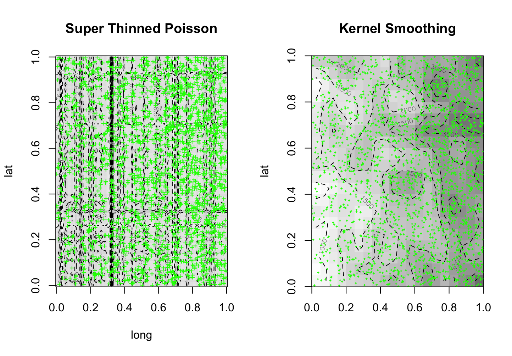
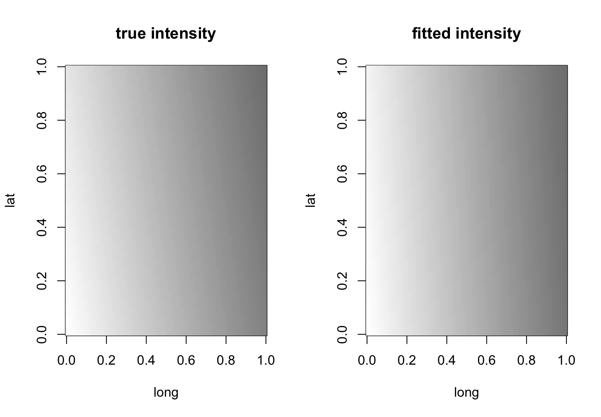

Overall, these plots are not very informative because earthquakes are not independent events by nature. A mainshock typically causes several after-shocks for a period of time. Thus, in the next section we show how a self-exciting process can be a better suited fit for modeling earthquakes in Morocco.

## Fitting a Hawkes Model
Earthquakes typically consist of a mainshock followed by a series of after-shocks. The after-schocks typically occur near the mainshock region, gradually decaying over time. Due to such self-exciting characteristics of earthquakes, fitting a hawkes model is a natural choice for analyzing temporal clustering of seismic activity. 
$\lambda(t, x, y) = \mu(x, y) + K \Sigma g_t(t - \tau_i)g_{xy}(x-x_i, y-y_i)$
$g_t(t) = \beta e^{-\beta t}$
$g(x,y) = \frac{\alpha}{\pi}e^{-\alpha r^2}$, where $x^2+y^2=r^2$

First, the geometric density plot of the spatial points clearly shows two major clusters, one in the North region and the other in the South region of Morocco. While the earthquakes in the northern region are more spread out, the earthquakes in the southern region are more concentrated and evenly distributed.
```
##### This is for fitting a Hawkes model with no magnitudes. 
##### lambda(t,x,y) = mu rho(x,y) + K SUM gt(t-t_i)gxy(x-xi,y-yi),  
##### with rho(x,y) = 1/(X1Y1), 
##### gt(t) = beta e^(-beta t),
##### g(x,y) = alpha/pi exp(-alpha r^2), with x^2+y^2=r^2,  
##### The space S = [0,X1] x [0,Y1] (km), in time [0,T]. 
##### For any theta, the integral of lambda over the space time region is approx. 
##### mu T + Kn.
##### The parameter vector theta = (mu, K, alpha, beta)

theta0 = list(mu=.08,K=.75,alpha=2.5,beta=3.5,b=1) 
## Give it b even if you don't use it, so it can generate magnitudes for each pt.  
# source("simetas2022.r")
T = 6939 #10^3 ## end of time window. 
z = simhawk(T=10^3,gmi=pointprod, gt=expgt, gxy = expxy)
X1 = 1
Y1 = 1
M0 = 3.5

m3 = function(x) signif(x,3)

## If you have: 
## datax 
## datay
## datat 
## datan, 
## then write  
## z = list()
## z$t = datat
## z$lon = datax 
## z$lat = datay 
## z$n = datan 
library(ggplot2) 
#help(stat_density_2d)
#example(geom_density_2d) 

z = list()
z$t = scale_values(as.numeric(earthquakes$Date))
z$lon = scale_values(earthquakes$Longitude)
z$lat = scale_values(earthquakes$Latitude)
z$n = 710

m <- ggplot(data.frame(z), aes(x = lat, y = lon))+
  ggtitle("Geometric Density of Earthquakes in Morocco from 2004 to 2023") +
  geom_point(cex=0.5) +
  xlim(-0.2, 1.2) +
  ylim(0, 1)
# contour lines
m + geom_density_2d()
```
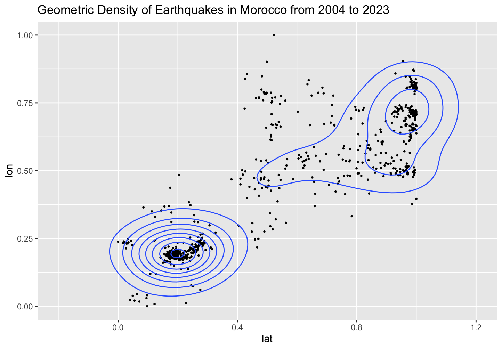

We fit the model above to estimate the parameters, $\mu, K, \alpha$, and $\beta$ for a normalized spatial region between 0 and 1. 

```
## Make sure the data are stored in z, and you define T,X1,Y1, and M0 externally. 
## First we will write the loglikelihood function in R. 
loglhawk = function(theta,draw=0){
  mu = theta[1]; K = theta[2]; alpha = theta[3]; beta = theta[4] 
  cat("\n mu = ",m3(mu),", K = ",m3(K),", alpha = ",m3(alpha),", beta = ",m3(beta),".\n") 
  if(min(mu,K,alpha,beta)<0.000000001) return(99999) 
  if(K>.99999) return(99999)
  if(draw){
    r = seq(0,3,length=100)
    t = alpha/pi * exp(-alpha * r^2)
    lines(r,t,col="orange",lty=2) 
  }
  sumlog = log(mu/X1/Y1) 
  intlam = mu*T + K*z$n
  const = K*alpha/pi*beta
  for(j in 2:(z$n)){
    gij = 0
    for(i in 1:(j-1)){
      r2 = (z$lon[j]-z$lon[i])^2+(z$lat[j]-z$lat[i])^2
      gij = gij + exp(-beta*(z$t[j]-z$t[i])-alpha*r2)
    }
    lamj = mu / X1 / Y1 + const*gij
    if(lamj < 0){
      cat("lambda ",j," is less than 0.")
      return(99999)
    }
    sumlog = sumlog + log(lamj)
  }
  loglik = sumlog - intlam
  cat("loglike is ", loglik, ". sumlog = ", sumlog,". integral = ", intlam,".\n")
  if(draw) lines(r,t,col="white",lty=2) 
  return(-1.0*loglik)
}

loglhawk(c(2,.3,2,2,1))

#theta1 = c(.5,.5,.5,.5) 
theta1 = c(.08,.75,2.5,3.5)/2
b1 = optim(theta1,loglhawk)
b2 = optim(b1$par,loglhawk,hessian=T)
theta2 = b2$par
sqrt(diag(solve(b2$hess))) ## for SEs 

## compare the fit. 
par(mfrow=c(1,1))
r = seq(0,1,length=100)
s = theta0$beta * exp(-theta0$beta * r)
plot(r,s,col="green",xlab="t",ylab="g(t)",type="l", main='Hawkes Model on Morocco Earthquake Data')
t = theta2[4]*exp(-theta2[4]*r)
lines(r,t,col="blue") 
legend("topright",lty=c(1,1),c("real","estimated"),col=c("green","blue"))

# copied from simetas2022
theta_alpha = theta0$alpha
expxy = function(n,m){
  ## define theta_alpha externally! 
  ## exponential triggering in space. f(r) = alpha/pi exp(-alpha r^2). 
  ## Here the density does not depend on magnitude of the mainshock. 
  ## To see that this is a density, 
  ## ∫f(x,y)dxdy = ∫f(r)rdrdø = 2π∫f(r)rdr 
  ## = 2alpha ∫ exp(-alpha r^2) r dr = -exp(-alpha r^2) ,r=0to∞, = 0+1, for alpha>0.  
  v = rexp(n,rate=theta_alpha)
  dist1 = sqrt(v)
  thet1 = runif(n)*2*pi
  x = cos(thet1)*dist1
  y = sin(thet1)*dist1
  cbind(x,y)
}

library(MASS) 
par(mfrow=c(1,2))
g2 = expxy(100000,1) #,theta0)
g3 = kde2d(g2[,1],g2[,2],lims=c(-1,1,-1,1))
image(g3,main="real")
contour(g3,add=T)
theta_alpha = theta2[3]
g4 = expxy(100000,1)#,theta=list(alpha=theta2[3]))
g5 = kde2d(g4[,1],g4[,2],lims=c(-1,1,-1,1))
image(g5,main="estimated")
contour(g5,add=T) 

par(mfrow=c(1,1))
theta1[3] = 2
r = seq(0,3,length=100)
s = theta0$alpha/pi*exp(-theta0$alpha*r^2)
t = theta2[3]/pi*exp(-theta2[3]*r^2)
plot(r,s,col="green",xlab="r",ylab="g(r)",type="l",ylim=range(c(s,t)))
lines(r,t,col="blue") 
legend("topright",lty=c(1,1),c("real","estimated"),col=c("green","blue")) 
b2 = optim(theta1,loglhawk,draw=1)
unlist(theta0)
m3(theta2)
title("Fitting Hawkes Model: Kernel Density Estimation ")
```
The plot of the estimated hawkes model captures the underlying kernel density of points pretty well. The innermost contour resembles a high density. Stepping outward on the contour plot resembles decreasing density. The kernel density estimation plot shows how the density estimates fit to the estimated hawkes model pretty well after a few iterations.
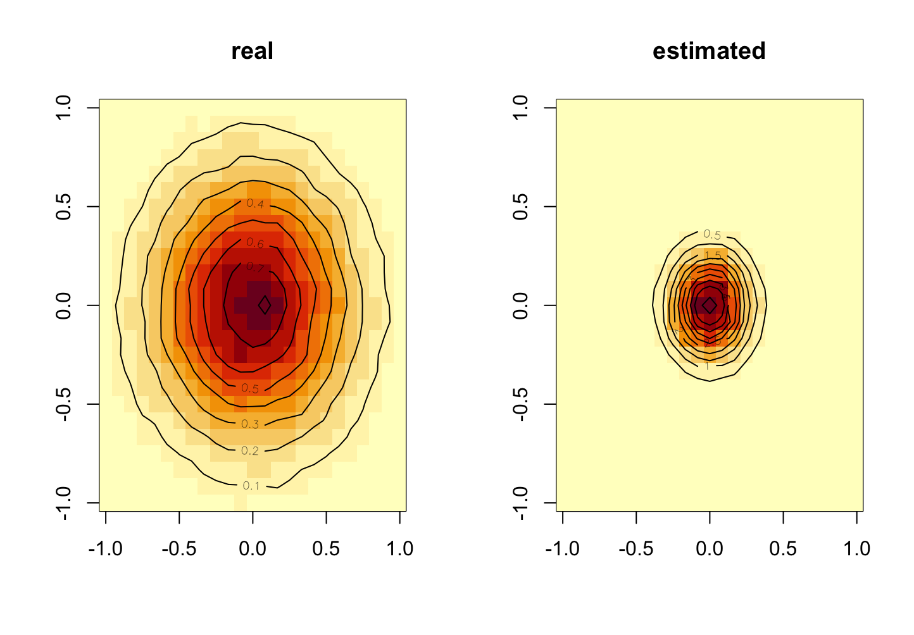
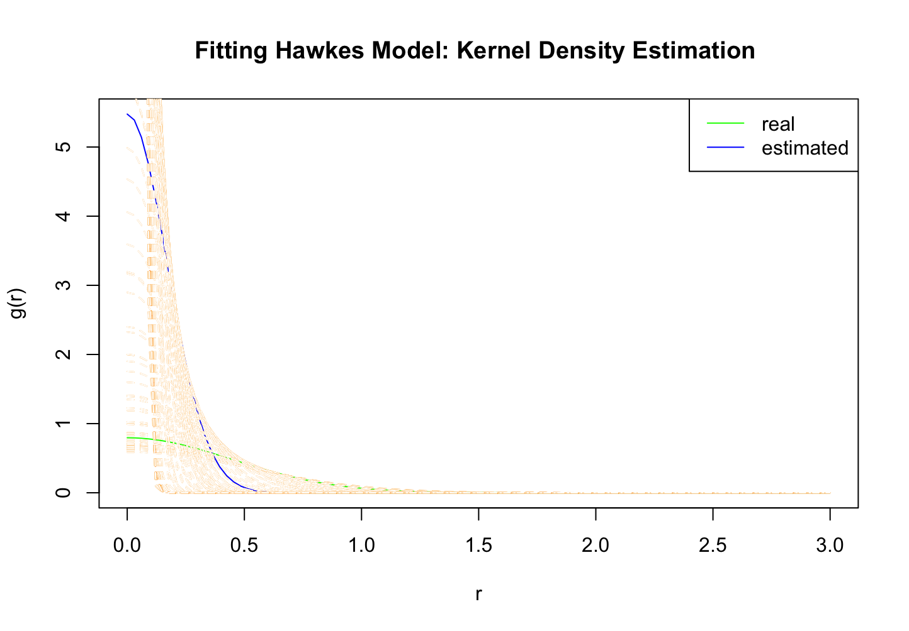

## Conclusion
Overall, I found that there was significant clustering in the north and south regions of Morocoo, suggesting that earthquakes occurred in these regions more frequently. While the psuedo log-likelihood and poisson Stoyan models were uninformative, the hawkes model gave us a great sense of how earthquakes in Morocco may be modeled as a self-exciting point process. For future work, I would consider information about deaths or infrastructure destruction occurring in the Morocco region as an additional variable of study. I would also further analyze the time component of earthquakes to investigate whether the next earthquake can be predicted from earthquakes at previous time steps. The autoregressive nature of the SARs model would make it a great choice for this analysis. 


